# [📈 Live Status](https://maxneuvians.github.io/etat-status): <!--live status--> **🟧 Partial outage**

This repository contains the open-source uptime monitor and status page for [Max Neuvians](https://maxneuvians.github.io/etat-status), powered by [Upptime](https://github.com/upptime/upptime).

With [Upptime](https://upptime.js.org), you can get your own unlimited and free uptime monitor and status page, powered entirely by a GitHub repository. We use [Issues](https://github.com/maxneuvians/etat-status/issues) as incident reports, [Actions](https://github.com/maxneuvians/etat-status/actions) as uptime monitors, and [Pages](https://maxneuvians.github.io/etat-status) for the status page.

<!--start: status pages-->
<!-- This summary is generated by Upptime (https://github.com/upptime/upptime) -->
<!-- Do not edit this manually, your changes will be overwritten -->
<!-- prettier-ignore -->
| URL | Status | History | Response Time | Uptime |
| --- | ------ | ------- | ------------- | ------ |
|  [Canada.ca](https://www.canada.ca) | 🟩 Up | [canada-ca.yml](https://github.com/maxneuvians/etat-status/commits/HEAD/history/canada-ca.yml) | 

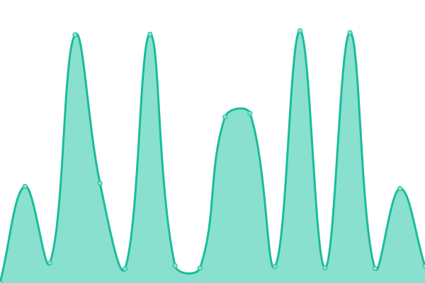 245ms
     
 | 

<a href="https://maxneuvians.github.io/etat-status/history/canada-ca">100.00%</a>
    

|  [Page d'accueil de Condition féminine Canada | Status of Women Canada Web Welcome Page](https://cfc-swc.gc.ca) | 🟩 Up | [page-d-accueil-de-condition-feminine-canada-status-of-women-canada-web-welcome-page.yml](https://github.com/maxneuvians/etat-status/commits/HEAD/history/page-d-accueil-de-condition-feminine-canada-status-of-women-canada-web-welcome-page.yml) | 

 345ms
     
 | 

<a href="https://maxneuvians.github.io/etat-status/history/page-d-accueil-de-condition-feminine-canada-status-of-women-canada-web-welcome-page">100.00%</a>
    

|  [Canadian Institutes of Health Research / Instituts de recherche en santé du Canada](https://cihr-irsc.gc.ca) | 🟩 Up | [canadian-institutes-of-health-research-instituts-de-recherche-en-sante-du-canada.yml](https://github.com/maxneuvians/etat-status/commits/HEAD/history/canadian-institutes-of-health-research-instituts-de-recherche-en-sante-du-canada.yml) | 

 120ms
     
 | 

<a href="https://maxneuvians.github.io/etat-status/history/canadian-institutes-of-health-research-instituts-de-recherche-en-sante-du-canada">100.00%</a>
    

|  [Canada Revenue Agency/Agence du revenu du Canada - Canada.ca](https://cra-arc.gc.ca) | 🟩 Up | [canada-revenue-agency-agence-du-revenu-du-canada-canada-ca.yml](https://github.com/maxneuvians/etat-status/commits/HEAD/history/canada-revenue-agency-agence-du-revenu-du-canada-canada-ca.yml) | 

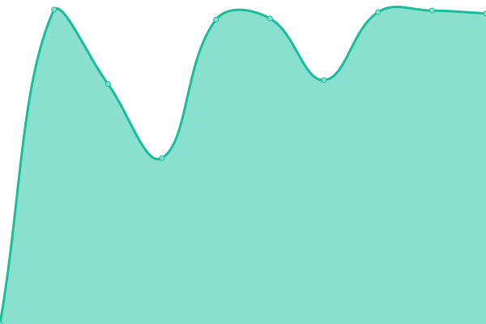 518ms
     
 | 

<a href="https://maxneuvians.github.io/etat-status/history/canada-revenue-agency-agence-du-revenu-du-canada-canada-ca">100.00%</a>
    

|  [Conseil de la radiodiffusion et des télécommunications canadiennes / Canadian Radio-television and Telecommunications Commission | CRTC](https://crtc.gc.ca) | 🟩 Up | [conseil-de-la-radiodiffusion-et-des-telecommunications-canadiennes-canadian-radio-television-and-telecommunications-commission-crtc.yml](https://github.com/maxneuvians/etat-status/commits/HEAD/history/conseil-de-la-radiodiffusion-et-des-telecommunications-canadiennes-canadian-radio-television-and-telecommunications-commission-crtc.yml) | 

 181ms
     
 | 

<a href="https://maxneuvians.github.io/etat-status/history/conseil-de-la-radiodiffusion-et-des-telecommunications-canadiennes-canadian-radio-television-and-telecommunications-commission-crtc">100.00%</a>
    

|  [Canadian Centre for Cyber Security](https://cyber.gc.ca) | 🟩 Up | [canadian-centre-for-cyber-security.yml](https://github.com/maxneuvians/etat-status/commits/HEAD/history/canadian-centre-for-cyber-security.yml) | 

 263ms
     
 | 

<a href="https://maxneuvians.github.io/etat-status/history/canadian-centre-for-cyber-security">100.00%</a>
    

|  [Home | Canadian Armed Forces](https://forces.ca) | 🟩 Up | [home-canadian-armed-forces.yml](https://github.com/maxneuvians/etat-status/commits/HEAD/history/home-canadian-armed-forces.yml) | 

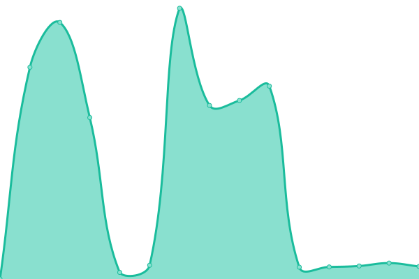 2730ms
     
 | 

<a href="https://maxneuvians.github.io/etat-status/history/home-canadian-armed-forces">98.90%</a>
    

|  [Canadian Museum for Human Rights](https://humanrights.ca) | 🟩 Up | [canadian-museum-for-human-rights.yml](https://github.com/maxneuvians/etat-status/commits/HEAD/history/canadian-museum-for-human-rights.yml) | 

 356ms
     
 | 

<a href="https://maxneuvians.github.io/etat-status/history/canadian-museum-for-human-rights">100.00%</a>
    

|  [Home | Ingenium](https://ingeniumcanada.org) | 🟩 Up | [home-ingenium.yml](https://github.com/maxneuvians/etat-status/commits/HEAD/history/home-ingenium.yml) | 

 1046ms
     
 | 

<a href="https://maxneuvians.github.io/etat-status/history/home-ingenium">100.00%</a>
    

|  [Immigration and Refugee Board of Canada | Commission de l'immigration et du statut de réfugié du Canada](https://irb-cisr.gc.ca) | 🟩 Up | [immigration-and-refugee-board-of-canada-commission-de-l-immigration-et-du-statut-de-refugie-du-canada.yml](https://github.com/maxneuvians/etat-status/commits/HEAD/history/immigration-and-refugee-board-of-canada-commission-de-l-immigration-et-du-statut-de-refugie-du-canada.yml) | 

 364ms
     
 | 

<a href="https://maxneuvians.github.io/etat-status/history/immigration-and-refugee-board-of-canada-commission-de-l-immigration-et-du-statut-de-refugie-du-canada">100.00%</a>
    

|  [Pages - Home](https://library-archives.canada.ca) | 🟩 Up | [pages-home.yml](https://github.com/maxneuvians/etat-status/commits/HEAD/history/pages-home.yml) | 

 378ms
     
 | 

<a href="https://maxneuvians.github.io/etat-status/history/pages-home">100.00%</a>
    

|  [Military Police Complaints Commission of Canada / Sélection de la langue - Commission dâexamen des plaintes concernant la police militaire du Canada](https://mpcc-cppm.gc.ca) | 🟥 Down | [military-police-complaints-commission-of-canada-selection-de-la-langue-commission-daexamen-des-plaintes-concernant-la-police-militaire-du-canada.yml](https://github.com/maxneuvians/etat-status/commits/HEAD/history/military-police-complaints-commission-of-canada-selection-de-la-langue-commission-daexamen-des-plaintes-concernant-la-police-militaire-du-canada.yml) | 

 0ms
     
 | 

<a href="https://maxneuvians.github.io/etat-status/history/military-police-complaints-commission-of-canada-selection-de-la-langue-commission-daexamen-des-plaintes-concernant-la-police-militaire-du-canada">100.00%</a>
    

|  [National Arts Centre | Canada is our stage](https://nac-cna.ca) | 🟩 Up | [national-arts-centre-canada-is-our-stage.yml](https://github.com/maxneuvians/etat-status/commits/HEAD/history/national-arts-centre-canada-is-our-stage.yml) | 

 4379ms
     
 | 

<a href="https://maxneuvians.github.io/etat-status/history/national-arts-centre-canada-is-our-stage">100.00%</a>
    

|  [Canadian Museum of Nature](https://nature.ca) | 🟩 Up | [canadian-museum-of-nature.yml](https://github.com/maxneuvians/etat-status/commits/HEAD/history/canadian-museum-of-nature.yml) | 

 146ms
     
 | 

<a href="https://maxneuvians.github.io/etat-status/history/canadian-museum-of-nature">100.00%</a>
    

|  [National Capital Commission -  National Capital Commission](https://ncc-ccn.gc.ca) | 🟩 Up | [national-capital-commission-national-capital-commission.yml](https://github.com/maxneuvians/etat-status/commits/HEAD/history/national-capital-commission-national-capital-commission.yml) | 

 307ms
     
 | 

<a href="https://maxneuvians.github.io/etat-status/history/national-capital-commission-national-capital-commission">100.00%</a>
    

|  [Northern Pipeline Agency / Sélection de la langue - Administration du pipe-line du Nord](https://northern-pipeline.canada.ca) | 🟩 Up | [northern-pipeline-agency-selection-de-la-langue-administration-du-pipe-line-du-nord.yml](https://github.com/maxneuvians/etat-status/commits/HEAD/history/northern-pipeline-agency-selection-de-la-langue-administration-du-pipe-line-du-nord.yml) | 

 227ms
     
 | 

<a href="https://maxneuvians.github.io/etat-status/history/northern-pipeline-agency-selection-de-la-langue-administration-du-pipe-line-du-nord">100.00%</a>
    

|  [Home - National Research Council Canada](https://nrc.canada.ca) | 🟩 Up | [home-national-research-council-canada.yml](https://github.com/maxneuvians/etat-status/commits/HEAD/history/home-national-research-council-canada.yml) | 

 2252ms
     
 | 

<a href="https://maxneuvians.github.io/etat-status/history/home-national-research-council-canada">99.43%</a>
    

|  [Home - National Research Council Canada](https://nrc-cnrc.gc.ca) | 🟩 Up | [home-national-research-council-canada.yml](https://github.com/maxneuvians/etat-status/commits/HEAD/history/home-national-research-council-canada.yml) | 

 2252ms
     
 | 

<a href="https://maxneuvians.github.io/etat-status/history/home-national-research-council-canada">99.43%</a>
    

|  [National Security and Intelligence Review Agency -](https://nsira-ossnr.gc.ca) | 🟩 Up | [national-security-and-intelligence-review-agency.yml](https://github.com/maxneuvians/etat-status/commits/HEAD/history/national-security-and-intelligence-review-agency.yml) | 

 1253ms
     
 | 

<a href="https://maxneuvians.github.io/etat-status/history/national-security-and-intelligence-review-agency">100.00%</a>
    

|  [Canadian Transportation Agency](https://otc-cta.gc.ca) | 🟩 Up | [canadian-transportation-agency.yml](https://github.com/maxneuvians/etat-status/commits/HEAD/history/canadian-transportation-agency.yml) | 

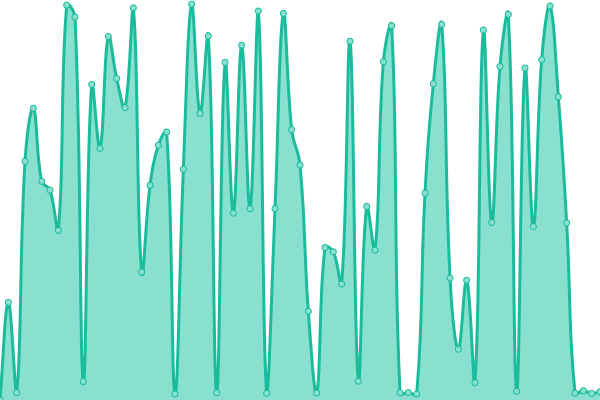 192ms
     
 | 

<a href="https://maxneuvians.github.io/etat-status/history/canadian-transportation-agency">100.00%</a>
    

|  [Privy Council Office - Canada.ca](https://pco.gc.ca) | 🟩 Up | [privy-council-office-canada-ca.yml](https://github.com/maxneuvians/etat-status/commits/HEAD/history/privy-council-office-canada-ca.yml) | 

 273ms
     
 | 

<a href="https://maxneuvians.github.io/etat-status/history/privy-council-office-canada-ca">100.00%</a>
    

|  [Prime Minister of Canada / Premier ministre du Canada](https://pm.gc.ca) | 🟩 Up | [prime-minister-of-canada-premier-ministre-du-canada.yml](https://github.com/maxneuvians/etat-status/commits/HEAD/history/prime-minister-of-canada-premier-ministre-du-canada.yml) | 

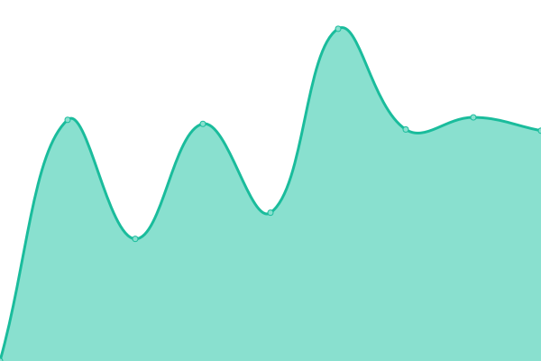 2326ms
     
 | 

<a href="https://maxneuvians.github.io/etat-status/history/prime-minister-of-canada-premier-ministre-du-canada">100.00%</a>
    

|  [None](https://pmprb-cepmb.gc.ca) | 🟩 Up | [none.yml](https://github.com/maxneuvians/etat-status/commits/HEAD/history/none.yml) | 

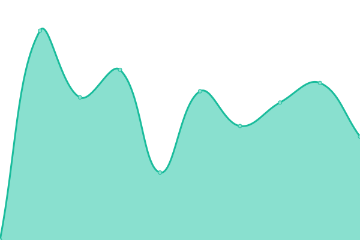 3103ms
     
 | 

<a href="https://maxneuvians.github.io/etat-status/history/none">100.00%</a>
    

|  [Publications du gouvernement du Canada | Government of Canada Publications](https://publications.gc.ca) | 🟩 Up | [publications-du-gouvernement-du-canada-government-of-canada-publications.yml](https://github.com/maxneuvians/etat-status/commits/HEAD/history/publications-du-gouvernement-du-canada-government-of-canada-publications.yml) | 

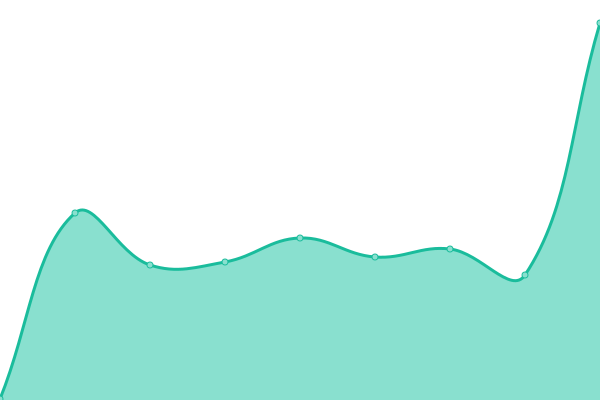 138ms
     
 | 

<a href="https://maxneuvians.github.io/etat-status/history/publications-du-gouvernement-du-canada-government-of-canada-publications">100.00%</a>
    

|  [Canada.ca](https://science.gc.ca) | 🟩 Up | [canada-ca.yml](https://github.com/maxneuvians/etat-status/commits/HEAD/history/canada-ca.yml) | 

 245ms
     
 | 

<a href="https://maxneuvians.github.io/etat-status/history/canada-ca">100.00%</a>
    

|  [Treasury Board of Canada Secretariat / Sélection de la langue - Secrétariat du Conseil du Trésor du Canada](https://tbs-sct.gc.ca) | 🟩 Up | [treasury-board-of-canada-secretariat-selection-de-la-langue-secretariat-du-conseil-du-tresor-du-canada.yml](https://github.com/maxneuvians/etat-status/commits/HEAD/history/treasury-board-of-canada-secretariat-selection-de-la-langue-secretariat-du-conseil-du-tresor-du-canada.yml) | 

 879ms
     
 | 

<a href="https://maxneuvians.github.io/etat-status/history/treasury-board-of-canada-secretariat-selection-de-la-langue-secretariat-du-conseil-du-tresor-du-canada">100.00%</a>
    

|  [Travel.gc.ca - Home](https://travel.gc.ca) | 🟩 Up | [travel-gc-ca-home.yml](https://github.com/maxneuvians/etat-status/commits/HEAD/history/travel-gc-ca-home.yml) | 

 857ms
     
 | 

<a href="https://maxneuvians.github.io/etat-status/history/travel-gc-ca-home">99.65%</a>
    

|  [Weather Information - Environment Canada](https://weather.gc.ca) | 🟩 Up | [weather-information-environment-canada.yml](https://github.com/maxneuvians/etat-status/commits/HEAD/history/weather-information-environment-canada.yml) | 

 738ms
     
 | 

<a href="https://maxneuvians.github.io/etat-status/history/weather-information-environment-canada">100.00%</a>
    

|  [Agence de promotion économique du Canada atlantique| Atlantic Canada Opportunities Agency](https://www.acoa-apeca.gc.ca) | 🟩 Up | [agence-de-promotion-economique-du-canada-atlantique-atlantic-canada-opportunities-agency.yml](https://github.com/maxneuvians/etat-status/commits/HEAD/history/agence-de-promotion-economique-du-canada-atlantique-atlantic-canada-opportunities-agency.yml) | 

 262ms
     
 | 

<a href="https://maxneuvians.github.io/etat-status/history/agence-de-promotion-economique-du-canada-atlantique-atlantic-canada-opportunities-agency">100.00%</a>
    

|  [Atomic Energy of Canada Ltd (AECL) - Home](https://www.aecl.ca) | 🟩 Up | [atomic-energy-of-canada-ltd-aecl-home.yml](https://github.com/maxneuvians/etat-status/commits/HEAD/history/atomic-energy-of-canada-ltd-aecl-home.yml) | 

 173ms
     
 | 

<a href="https://maxneuvians.github.io/etat-status/history/atomic-energy-of-canada-ltd-aecl-home">100.00%</a>
    

|  [Agriculture and Agri-Food Canada / Sélection de la langue - Agriculture et Agroalimentaire Canada](https://www.agr.gc.ca) | 🟩 Up | [agriculture-and-agri-food-canada-selection-de-la-langue-agriculture-et-agroalimentaire-canada.yml](https://github.com/maxneuvians/etat-status/commits/HEAD/history/agriculture-and-agri-food-canada-selection-de-la-langue-agriculture-et-agroalimentaire-canada.yml) | 

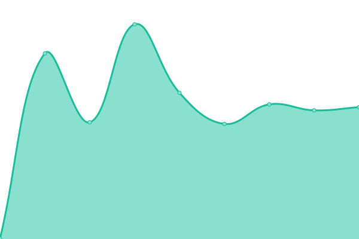 319ms
     
 | 

<a href="https://maxneuvians.github.io/etat-status/history/agriculture-and-agri-food-canada-selection-de-la-langue-agriculture-et-agroalimentaire-canada">100.00%</a>
    

|  [Agence spatiale canadienne | Canadian Space Agency](https://www.asc-csa.gc.ca) | 🟩 Up | [agence-spatiale-canadienne-canadian-space-agency.yml](https://github.com/maxneuvians/etat-status/commits/HEAD/history/agence-spatiale-canadienne-canadian-space-agency.yml) | 

 150ms
     
 | 

<a href="https://maxneuvians.github.io/etat-status/history/agence-spatiale-canadienne-canadian-space-agency">100.00%</a>
    

|  [Bank of Canada](https://www.bankofcanada.ca) | 🟩 Up | [bank-of-canada.yml](https://github.com/maxneuvians/etat-status/commits/HEAD/history/bank-of-canada.yml) | 

 193ms
     
 | 

<a href="https://maxneuvians.github.io/etat-status/history/bank-of-canada">100.00%</a>
    

|  [BDC - The Bank for Canadian Entrepreneurs | BDC.ca](https://www.bdc.ca) | 🟩 Up | [bdc-the-bank-for-canadian-entrepreneurs-bdc-ca.yml](https://github.com/maxneuvians/etat-status/commits/HEAD/history/bdc-the-bank-for-canadian-entrepreneurs-bdc-ca.yml) | 

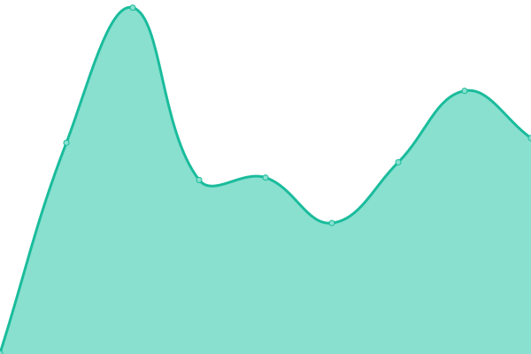 426ms
     
 | 

<a href="https://maxneuvians.github.io/etat-status/history/bdc-the-bank-for-canadian-entrepreneurs-bdc-ca">100.00%</a>
    

|  [Mailing and shipping for Personal and Business | Canada Post](https://www.canadapost-postescanada.ca) | 🟩 Up | [mailing-and-shipping-for-personal-and-business-canada-post.yml](https://github.com/maxneuvians/etat-status/commits/HEAD/history/mailing-and-shipping-for-personal-and-business-canada-post.yml) | 

 1172ms
     
 | 

<a href="https://maxneuvians.github.io/etat-status/history/mailing-and-shipping-for-personal-and-business-canada-post">100.00%</a>
    

|  [Canadian Northern Economic Development Agency / Agence canadienne de développement économique du Nord - Canada.ca](https://www.cannor.gc.ca) | 🟩 Up | [canadian-northern-economic-development-agency-agence-canadienne-de-developpement-economique-du-nord-canada-ca.yml](https://github.com/maxneuvians/etat-status/commits/HEAD/history/canadian-northern-economic-development-agency-agence-canadienne-de-developpement-economique-du-nord-canada-ca.yml) | 

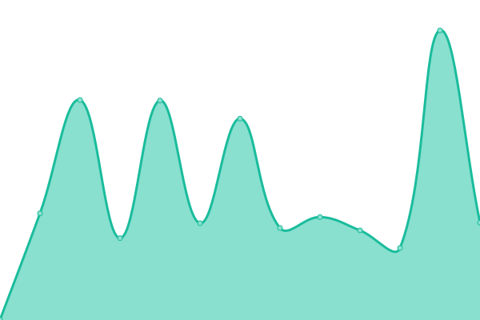 484ms
     
 | 

<a href="https://maxneuvians.github.io/etat-status/history/canadian-northern-economic-development-agency-agence-canadienne-de-developpement-economique-du-nord-canada-ca">100.00%</a>
    

|  [Welcome to Courts Administration Service | Bienvenue au Service administratif des tribunaux judiciaires](https://www.cas-satj.gc.ca) | 🟩 Up | [welcome-to-courts-administration-service-bienvenue-au-service-administratif-des-tribunaux-judiciaires.yml](https://github.com/maxneuvians/etat-status/commits/HEAD/history/welcome-to-courts-administration-service-bienvenue-au-service-administratif-des-tribunaux-judiciaires.yml) | 

 204ms
     
 | 

<a href="https://maxneuvians.github.io/etat-status/history/welcome-to-courts-administration-service-bienvenue-au-service-administratif-des-tribunaux-judiciaires">100.00%</a>
    

|  [Canadian Air Transport Security Authority / L'administration canadienne de la sûreté du transport aérien](https://www.catsa-acsta.gc.ca) | 🟩 Up | [canadian-air-transport-security-authority-l-administration-canadienne-de-la-s-a-rete-du-transport-aerien.yml](https://github.com/maxneuvians/etat-status/commits/HEAD/history/canadian-air-transport-security-authority-l-administration-canadienne-de-la-s-a-rete-du-transport-aerien.yml) | 

 169ms
     
 | 

<a href="https://maxneuvians.github.io/etat-status/history/canadian-air-transport-security-authority-l-administration-canadienne-de-la-s-a-rete-du-transport-aerien">100.00%</a>
    

|  [Splash | Copyright Board of Canada](https://www.cb-cda.gc.ca) | 🟩 Up | [splash-copyright-board-of-canada.yml](https://github.com/maxneuvians/etat-status/commits/HEAD/history/splash-copyright-board-of-canada.yml) | 

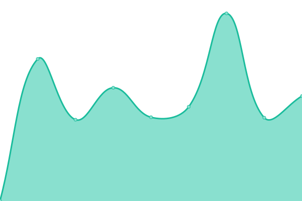 608ms
     
 | 

<a href="https://maxneuvians.github.io/etat-status/history/splash-copyright-board-of-canada">99.41%</a>
    

|  [CBC.ca - watch, listen, and discover with Canada's Public Broadcaster](https://www.cbc.ca) | 🟩 Up | [cbc-ca-watch-listen-and-discover-with-canada-s-public-broadcaster.yml](https://github.com/maxneuvians/etat-status/commits/HEAD/history/cbc-ca-watch-listen-and-discover-with-canada-s-public-broadcaster.yml) | 

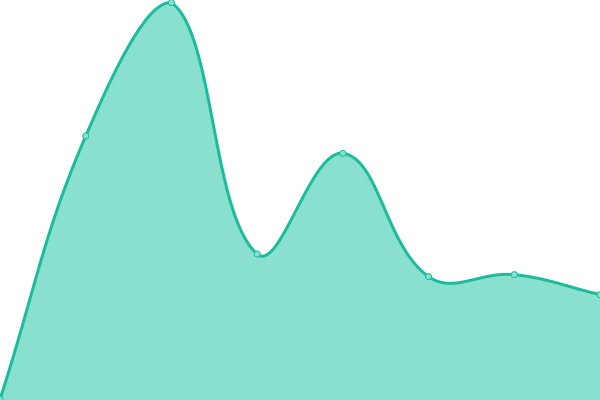 313ms
     
 | 

<a href="https://maxneuvians.github.io/etat-status/history/cbc-ca-watch-listen-and-discover-with-canada-s-public-broadcaster">100.00%</a>
    

|  [Canada Border Services Agency | Agence des services frontaliers du Canada](https://www.cbsa-asfc.gc.ca) | 🟩 Up | [canada-border-services-agency-agence-des-services-frontaliers-du-canada.yml](https://github.com/maxneuvians/etat-status/commits/HEAD/history/canada-border-services-agency-agence-des-services-frontaliers-du-canada.yml) | 

 266ms
     
 | 

<a href="https://maxneuvians.github.io/etat-status/history/canada-border-services-agency-agence-des-services-frontaliers-du-canada">100.00%</a>
    

|  [Bienvenue sur les plaines d'Abraham / Welcome to the Plains of Abraham](https://www.ccbn-nbc.gc.ca) | 🟩 Up | [bienvenue-sur-les-plaines-d-abraham-welcome-to-the-plains-of-abraham.yml](https://github.com/maxneuvians/etat-status/commits/HEAD/history/bienvenue-sur-les-plaines-d-abraham-welcome-to-the-plains-of-abraham.yml) | 

 1197ms
     
 | 

<a href="https://maxneuvians.github.io/etat-status/history/bienvenue-sur-les-plaines-d-abraham-welcome-to-the-plains-of-abraham">100.00%</a>
    

|  [Canadian Commercial Corporation | CCC](https://www.ccc.ca) | 🟩 Up | [canadian-commercial-corporation-ccc.yml](https://github.com/maxneuvians/etat-status/commits/HEAD/history/canadian-commercial-corporation-ccc.yml) | 

 275ms
     
 | 

<a href="https://maxneuvians.github.io/etat-status/history/canadian-commercial-corporation-ccc">100.00%</a>
    

|  [Canadian Centre for Occupational Health and Safety](https://www.ccohs.ca) | 🟩 Up | [canadian-centre-for-occupational-health-and-safety.yml](https://github.com/maxneuvians/etat-status/commits/HEAD/history/canadian-centre-for-occupational-health-and-safety.yml) | 

 204ms
     
 | 

<a href="https://maxneuvians.github.io/etat-status/history/canadian-centre-for-occupational-health-and-safety">100.00%</a>
    

|  [Home - CDIC](https://www.cdic.ca) | 🟩 Up | [home-cdic.yml](https://github.com/maxneuvians/etat-status/commits/HEAD/history/home-cdic.yml) | 

 710ms
     
 | 

<a href="https://maxneuvians.github.io/etat-status/history/home-cdic">100.00%</a>
    

|  [Canada Energy Regulator Site | Site de Régie de lâénergie du Canada](https://www.cer-rec.gc.ca) | 🟩 Up | [canada-energy-regulator-site-site-de-regie-de-laenergie-du-canada.yml](https://github.com/maxneuvians/etat-status/commits/HEAD/history/canada-energy-regulator-site-site-de-regie-de-laenergie-du-canada.yml) | 

 327ms
     
 | 

<a href="https://maxneuvians.github.io/etat-status/history/canada-energy-regulator-site-site-de-regie-de-laenergie-du-canada">100.00%</a>
    

|  [Home | Canadian Human Rights Commission](https://www.chrc-ccdp.gc.ca) | 🟩 Up | [home-canadian-human-rights-commission.yml](https://github.com/maxneuvians/etat-status/commits/HEAD/history/home-canadian-human-rights-commission.yml) | 

 284ms
     
 | 

<a href="https://maxneuvians.github.io/etat-status/history/home-canadian-human-rights-commission">100.00%</a>
    

|  [Canada Mortgage and Housing Corporation | CMHC](https://www.cmhc-schl.gc.ca) | 🟩 Up | [canada-mortgage-and-housing-corporation-cmhc.yml](https://github.com/maxneuvians/etat-status/commits/HEAD/history/canada-mortgage-and-housing-corporation-cmhc.yml) | 

 2067ms
     
 | 

<a href="https://maxneuvians.github.io/etat-status/history/canada-mortgage-and-housing-corporation-cmhc">100.00%</a>
    

|  [Canadian Nuclear Safety Commission - Commission canadienne de sûreté nucléaire](https://www.cnsc-ccsn.gc.ca) | 🟩 Up | [canadian-nuclear-safety-commission-commission-canadienne-de-s-a-rete-nucleaire.yml](https://github.com/maxneuvians/etat-status/commits/HEAD/history/canadian-nuclear-safety-commission-commission-canadienne-de-s-a-rete-nucleaire.yml) | 

 73ms
     
 | 

<a href="https://maxneuvians.github.io/etat-status/history/canadian-nuclear-safety-commission-commission-canadienne-de-s-a-rete-nucleaire">100.00%</a>
    

|  [Welcome | Civilian Review and Complaints Commission for the RCMP](https://www.crcc-ccetp.gc.ca) | 🟩 Up | [welcome-civilian-review-and-complaints-commission-for-the-rcmp.yml](https://github.com/maxneuvians/etat-status/commits/HEAD/history/welcome-civilian-review-and-complaints-commission-for-the-rcmp.yml) | 

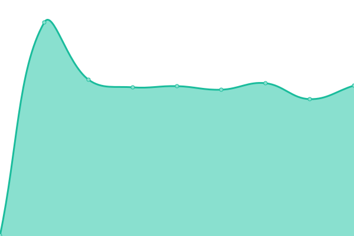 251ms
     
 | 

<a href="https://maxneuvians.github.io/etat-status/history/welcome-civilian-review-and-complaints-commission-for-the-rcmp">100.00%</a>
    

|  [Correctional Service Canada / Service correctionnel Canada](https://www.csc-scc.gc.ca) | 🟩 Up | [correctional-service-canada-service-correctionnel-canada.yml](https://github.com/maxneuvians/etat-status/commits/HEAD/history/correctional-service-canada-service-correctionnel-canada.yml) | 

 193ms
     
 | 

<a href="https://maxneuvians.github.io/etat-status/history/correctional-service-canada-service-correctionnel-canada">100.00%</a>
    

|  [Communications Security Establishment Canada](https://www.cse-cst.gc.ca) | 🟩 Up | [communications-security-establishment-canada.yml](https://github.com/maxneuvians/etat-status/commits/HEAD/history/communications-security-establishment-canada.yml) | 

 187ms
     
 | 

<a href="https://maxneuvians.github.io/etat-status/history/communications-security-establishment-canada">100.00%</a>
    

|  [Canada School of Public Service / École de la fonction publique du Canada](https://www.csps-efpc.gc.ca) | 🟩 Up | [canada-school-of-public-service-ecole-de-la-fonction-publique-du-canada.yml](https://github.com/maxneuvians/etat-status/commits/HEAD/history/canada-school-of-public-service-ecole-de-la-fonction-publique-du-canada.yml) | 

 181ms
     
 | 

<a href="https://maxneuvians.github.io/etat-status/history/canada-school-of-public-service-ecole-de-la-fonction-publique-du-canada">100.00%</a>
    

|  [DEC | Développement économique Canada pour les régions du Québec | Accueil](https://www.dec-ced.gc.ca) | 🟥 Down | [dec-developpement-economique-canada-pour-les-regions-du-quebec-accueil.yml](https://github.com/maxneuvians/etat-status/commits/HEAD/history/dec-developpement-economique-canada-pour-les-regions-du-quebec-accueil.yml) | 

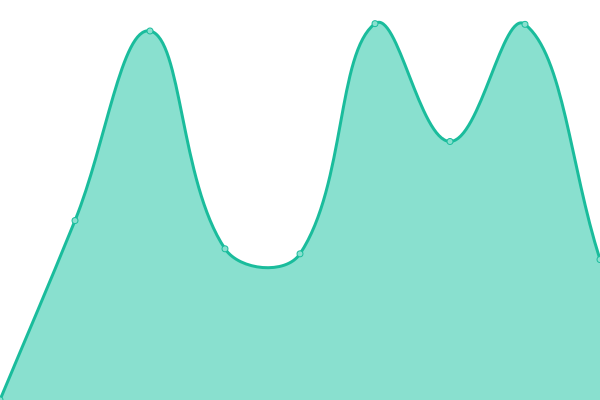 0ms
     
 | 

<a href="https://maxneuvians.github.io/etat-status/history/dec-developpement-economique-canada-pour-les-regions-du-quebec-accueil">100.00%</a>
    

|  [Fisheries and Oceans Canada | Pêches et Océans Canada](https://www.dfo-mpo.gc.ca) | 🟩 Up | [fisheries-and-oceans-canada-pa-ches-et-oceans-canada.yml](https://github.com/maxneuvians/etat-status/commits/HEAD/history/fisheries-and-oceans-canada-pa-ches-et-oceans-canada.yml) | 

 210ms
     
 | 

<a href="https://maxneuvians.github.io/etat-status/history/fisheries-and-oceans-canada-pa-ches-et-oceans-canada">100.00%</a>
    

|  [Export Development Canada (EDC)](https://www.edc.ca) | 🟩 Up | [export-development-canada-edc.yml](https://github.com/maxneuvians/etat-status/commits/HEAD/history/export-development-canada-edc.yml) | 

 945ms
     
 | 

<a href="https://maxneuvians.github.io/etat-status/history/export-development-canada-edc">100.00%</a>
    

|  [Farm Credit Canada | FCC](https://www.fcc-fac.ca) | 🟩 Up | [farm-credit-canada-fcc.yml](https://github.com/maxneuvians/etat-status/commits/HEAD/history/farm-credit-canada-fcc.yml) | 

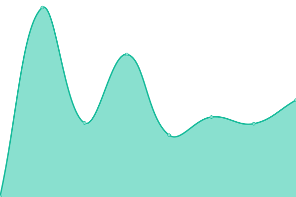 297ms
     
 | 

<a href="https://maxneuvians.github.io/etat-status/history/farm-credit-canada-fcc">100.00%</a>
    

|  [Federal Economic Development Agency for Southern Ontario Main Site / Sélection de la langue - Site principal Agence fédérale de développement économique pour le Sud de l'Ontario](https://www.feddevontario.gc.ca) | 🟩 Up | [federal-economic-development-agency-for-southern-ontario-main-site-selection-de-la-langue-site-principal-agence-federale-de-developpement-economique-pour-le-sud-de-l-ontario.yml](https://github.com/maxneuvians/etat-status/commits/HEAD/history/federal-economic-development-agency-for-southern-ontario-main-site-selection-de-la-langue-site-principal-agence-federale-de-developpement-economique-pour-le-sud-de-l-ontario.yml) | 

 388ms
     
 | 

<a href="https://maxneuvians.github.io/etat-status/history/federal-economic-development-agency-for-southern-ontario-main-site-selection-de-la-langue-site-principal-agence-federale-de-developpement-economique-pour-le-sud-de-l-ontario">100.00%</a>
    

|  [Financial Transactions and Reports Analysis Centre of Canada (FINTRAC) / Sélection de la langue - Centre d'analyse des opérations et déclarations financières du Canada (CANAFE)](https://www.fintrac-canafe.gc.ca) | 🟩 Up | [financial-transactions-and-reports-analysis-centre-of-canada-fintrac-selection-de-la-langue-centre-d-analyse-des-operations-et-declarations-financieres-du-canada-canafe.yml](https://github.com/maxneuvians/etat-status/commits/HEAD/history/financial-transactions-and-reports-analysis-centre-of-canada-fintrac-selection-de-la-langue-centre-d-analyse-des-operations-et-declarations-financieres-du-canada-canafe.yml) | 

 276ms
     
 | 

<a href="https://maxneuvians.github.io/etat-status/history/financial-transactions-and-reports-analysis-centre-of-canada-fintrac-selection-de-la-langue-centre-d-analyse-des-operations-et-declarations-financieres-du-canada-canafe">100.00%</a>
    

|  [Office of the Commissioner for Federal Judicial Affairs Canada](https://www.fja-cmf.gc.ca) | 🟩 Up | [office-of-the-commissioner-for-federal-judicial-affairs-canada.yml](https://github.com/maxneuvians/etat-status/commits/HEAD/history/office-of-the-commissioner-for-federal-judicial-affairs-canada.yml) | 

 162ms
     
 | 

<a href="https://maxneuvians.github.io/etat-status/history/office-of-the-commissioner-for-federal-judicial-affairs-canada">100.00%</a>
    

|  [National Gallery of Canada](https://www.gallery.ca) | 🟩 Up | [national-gallery-of-canada.yml](https://github.com/maxneuvians/etat-status/commits/HEAD/history/national-gallery-of-canada.yml) | 

 220ms
     
 | 

<a href="https://maxneuvians.github.io/etat-status/history/national-gallery-of-canada">100.00%</a>
    

|  [Governor General of Canada | Gouverneure générale du Canada](https://www.gg.ca) | 🟩 Up | [governor-general-of-canada-gouverneure-generale-du-canada.yml](https://github.com/maxneuvians/etat-status/commits/HEAD/history/governor-general-of-canada-gouverneure-generale-du-canada.yml) | 

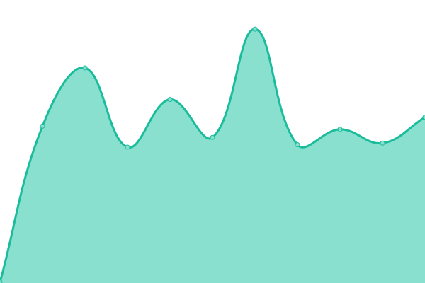 146ms
     
 | 

<a href="https://maxneuvians.github.io/etat-status/history/governor-general-of-canada-gouverneure-generale-du-canada">100.00%</a>
    

|  [Canadian Grain Commission (CGC) | Commission canadienne des grains (CCG)](https://www.grainscanada.gc.ca) | 🟩 Up | [canadian-grain-commission-cgc-commission-canadienne-des-grains-ccg.yml](https://github.com/maxneuvians/etat-status/commits/HEAD/history/canadian-grain-commission-cgc-commission-canadienne-des-grains-ccg.yml) | 

 283ms
     
 | 

<a href="https://maxneuvians.github.io/etat-status/history/canadian-grain-commission-cgc-commission-canadienne-des-grains-ccg">100.00%</a>
    

|  [Home | Canadian Museum of History](https://www.historymuseum.ca) | 🟩 Up | [home-canadian-museum-of-history.yml](https://github.com/maxneuvians/etat-status/commits/HEAD/history/home-canadian-museum-of-history.yml) | 

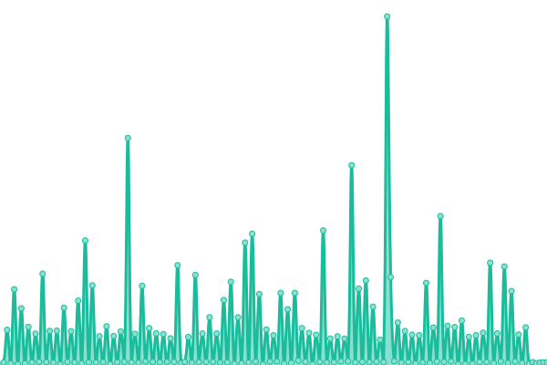 2982ms
     
 | 

<a href="https://maxneuvians.github.io/etat-status/history/home-canadian-museum-of-history">100.00%</a>
    

|  [Innovation, Science and Economic Development Canada Main Site / Sélection de la langue - Site principal d'Innovation, Sciences et Développement économique Canada](https://www.ic.gc.ca) | 🟩 Up | [innovation-science-and-economic-development-canada-main-site-selection-de-la-langue-site-principal-d-innovation-sciences-et-developpement-economique-canada.yml](https://github.com/maxneuvians/etat-status/commits/HEAD/history/innovation-science-and-economic-development-canada-main-site-selection-de-la-langue-site-principal-d-innovation-sciences-et-developpement-economique-canada.yml) | 

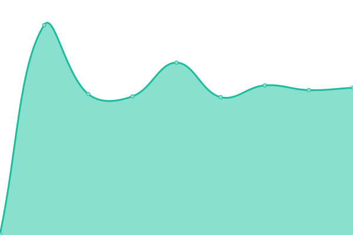 174ms
     
 | 

<a href="https://maxneuvians.github.io/etat-status/history/innovation-science-and-economic-development-canada-main-site-selection-de-la-langue-site-principal-d-innovation-sciences-et-developpement-economique-canada">100.00%</a>
    

|  [IDRC - International Development Research Centre](https://www.idrc.ca) | 🟩 Up | [idrc-international-development-research-centre.yml](https://github.com/maxneuvians/etat-status/commits/HEAD/history/idrc-international-development-research-centre.yml) | 

 598ms
     
 | 

<a href="https://maxneuvians.github.io/etat-status/history/idrc-international-development-research-centre">99.53%</a>
    

|  [Infrastructure Canada / Infrastructure Canada](https://www.infrastructure.gc.ca) | 🟩 Up | [infrastructure-canada-infrastructure-canada.yml](https://github.com/maxneuvians/etat-status/commits/HEAD/history/infrastructure-canada-infrastructure-canada.yml) | 

 175ms
     
 | 

<a href="https://maxneuvians.github.io/etat-status/history/infrastructure-canada-infrastructure-canada">99.71%</a>
    

|  [Canadian Food Inspection Agency / Sélection de la langue - Agence canadienne d'inspection des aliments](https://www.inspection.gc.ca) | 🟩 Up | [canadian-food-inspection-agency-selection-de-la-langue-agence-canadienne-d-inspection-des-aliments.yml](https://github.com/maxneuvians/etat-status/commits/HEAD/history/canadian-food-inspection-agency-selection-de-la-langue-agence-canadienne-d-inspection-des-aliments.yml) | 

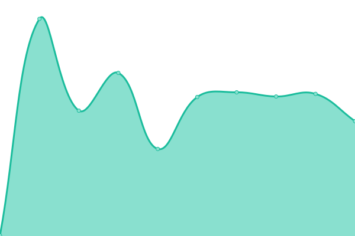 378ms
     
 | 

<a href="https://maxneuvians.github.io/etat-status/history/canadian-food-inspection-agency-selection-de-la-langue-agence-canadienne-d-inspection-des-aliments">100.00%</a>
    

|  [Global Affairs Canada – Splash page / Affaires mondiales Canada – Page de garde](https://www.international.gc.ca) | 🟩 Up | [global-affairs-canada-splash-page-affaires-mondiales-canada-page-de-garde.yml](https://github.com/maxneuvians/etat-status/commits/HEAD/history/global-affairs-canada-splash-page-affaires-mondiales-canada-page-de-garde.yml) | 

 751ms
     
 | 

<a href="https://maxneuvians.github.io/etat-status/history/global-affairs-canada-splash-page-affaires-mondiales-canada-page-de-garde">100.00%</a>
    

|  [Department of Justice / Sélection de la langue - Ministère de la Justice](https://www.justice.gc.ca) | 🟩 Up | [department-of-justice-selection-de-la-langue-ministere-de-la-justice.yml](https://github.com/maxneuvians/etat-status/commits/HEAD/history/department-of-justice-selection-de-la-langue-ministere-de-la-justice.yml) | 

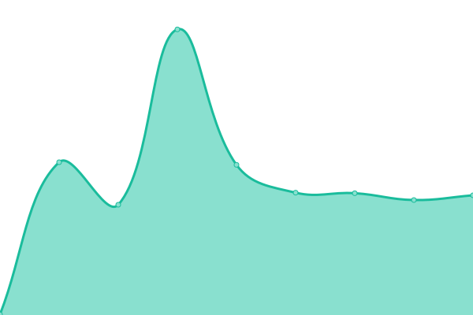 195ms
     
 | 

<a href="https://maxneuvians.github.io/etat-status/history/department-of-justice-selection-de-la-langue-ministere-de-la-justice">100.00%</a>
    

|  [Canadian Coins, Gold, Silver & More  | The Royal Canadian Mint](https://www.mint.ca) | 🟩 Up | [canadian-coins-gold-silver-and-more-the-royal-canadian-mint.yml](https://github.com/maxneuvians/etat-status/commits/HEAD/history/canadian-coins-gold-silver-and-more-the-royal-canadian-mint.yml) | 

 542ms
     
 | 

<a href="https://maxneuvians.github.io/etat-status/history/canadian-coins-gold-silver-and-more-the-royal-canadian-mint">100.00%</a>
    

|  [National Film Board of Canada](https://www.nfb.ca) | 🟩 Up | [national-film-board-of-canada.yml](https://github.com/maxneuvians/etat-status/commits/HEAD/history/national-film-board-of-canada.yml) | 

 2081ms
     
 | 

<a href="https://maxneuvians.github.io/etat-status/history/national-film-board-of-canada">100.00%</a>
    

|  [Natural Resources Canada / Sélection de la langue - Ressources naturelles Canada](https://www.nrcan.gc.ca) | 🟩 Up | [natural-resources-canada-selection-de-la-langue-ressources-naturelles-canada.yml](https://github.com/maxneuvians/etat-status/commits/HEAD/history/natural-resources-canada-selection-de-la-langue-ressources-naturelles-canada.yml) | 

 195ms
     
 | 

<a href="https://maxneuvians.github.io/etat-status/history/natural-resources-canada-selection-de-la-langue-ressources-naturelles-canada">100.00%</a>
    

|  [Natural Sciences and Engineering Research Council of Canada  | Conseil de recherches en sciences naturelles et en génie du Canada](https://www.nserc-crsng.gc.ca) | 🟥 Down | [natural-sciences-and-engineering-research-council-of-canada-conseil-de-recherches-en-sciences-naturelles-et-en-genie-du-canada.yml](https://github.com/maxneuvians/etat-status/commits/HEAD/history/natural-sciences-and-engineering-research-council-of-canada-conseil-de-recherches-en-sciences-naturelles-et-en-genie-du-canada.yml) | 

 0ms
     
 | 

<a href="https://maxneuvians.github.io/etat-status/history/natural-sciences-and-engineering-research-council-of-canada-conseil-de-recherches-en-sciences-naturelles-et-en-genie-du-canada">100.00%</a>
    

|  [National Security and Intelligence Committee of Parliamentarians (NSICOP)](https://www.nsicop-cpsnr.ca) | 🟩 Up | [national-security-and-intelligence-committee-of-parliamentarians-nsicop.yml](https://github.com/maxneuvians/etat-status/commits/HEAD/history/national-security-and-intelligence-committee-of-parliamentarians-nsicop.yml) | 

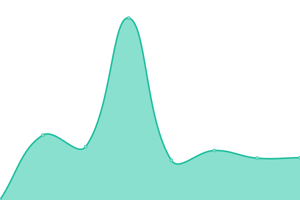 277ms
     
 | 

<a href="https://maxneuvians.github.io/etat-status/history/national-security-and-intelligence-committee-of-parliamentarians-nsicop">100.00%</a>
    

|  [Landing Language Selector | OCI | BEC](https://www.oci-bec.gc.ca) | 🟩 Up | [landing-language-selector-oci-bec.yml](https://github.com/maxneuvians/etat-status/commits/HEAD/history/landing-language-selector-oci-bec.yml) | 

 364ms
     
 | 

<a href="https://maxneuvians.github.io/etat-status/history/landing-language-selector-oci-bec">100.00%</a>
    

|  [Office of the Superintendent of Financial Institutions](https://www.osfi-bsif.gc.ca) | 🟩 Up | [office-of-the-superintendent-of-financial-institutions.yml](https://github.com/maxneuvians/etat-status/commits/HEAD/history/office-of-the-superintendent-of-financial-institutions.yml) | 

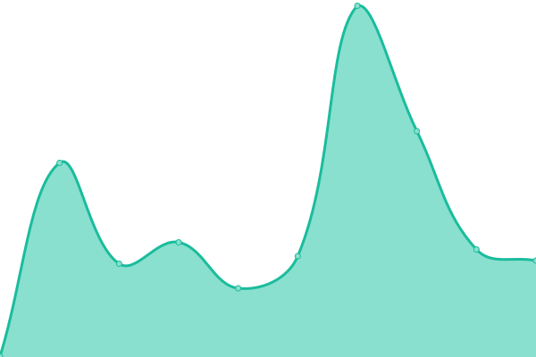 220ms
     
 | 

<a href="https://maxneuvians.github.io/etat-status/history/office-of-the-superintendent-of-financial-institutions">100.00%</a>
    

|  [Parks Canada](https://www.pc.gc.ca) | 🟩 Up | [parks-canada.yml](https://github.com/maxneuvians/etat-status/commits/HEAD/history/parks-canada.yml) | 

 243ms
     
 | 

<a href="https://maxneuvians.github.io/etat-status/history/parks-canada">100.00%</a>
    

|  [Public Prosecution Service of Canada / Sélection de la langue - Service des poursuites pénales du Canada](https://www.ppsc-sppc.gc.ca) | 🟩 Up | [public-prosecution-service-of-canada-selection-de-la-langue-service-des-poursuites-penales-du-canada.yml](https://github.com/maxneuvians/etat-status/commits/HEAD/history/public-prosecution-service-of-canada-selection-de-la-langue-service-des-poursuites-penales-du-canada.yml) | 

 214ms
     
 | 

<a href="https://maxneuvians.github.io/etat-status/history/public-prosecution-service-of-canada-selection-de-la-langue-service-des-poursuites-penales-du-canada">100.00%</a>
    

|  [Public Safety Canada / Sécurité publique Canada](https://www.publicsafety.gc.ca) | 🟩 Up | [public-safety-canada-securite-publique-canada.yml](https://github.com/maxneuvians/etat-status/commits/HEAD/history/public-safety-canada-securite-publique-canada.yml) | 

 190ms
     
 | 

<a href="https://maxneuvians.github.io/etat-status/history/public-safety-canada-securite-publique-canada">100.00%</a>
    

|  [Relations Couronne-Autochtones et Affaires du Nord Canada / Crown-Indigenous Relations and Northern Affairs Canada - Canada.ca](https://www.rcaanc-cirnac.gc.ca) | 🟩 Up | [relations-couronne-autochtones-et-affaires-du-nord-canada-crown-indigenous-relations-and-northern-affairs-canada-canada-ca.yml](https://github.com/maxneuvians/etat-status/commits/HEAD/history/relations-couronne-autochtones-et-affaires-du-nord-canada-crown-indigenous-relations-and-northern-affairs-canada-canada-ca.yml) | 

 452ms
     
 | 

<a href="https://maxneuvians.github.io/etat-status/history/relations-couronne-autochtones-et-affaires-du-nord-canada-crown-indigenous-relations-and-northern-affairs-canada-canada-ca">100.00%</a>
    

|  [National Home Page | Royal Canadian Mounted Police](https://www.rcmp-grc.gc.ca) | 🟩 Up | [national-home-page-royal-canadian-mounted-police.yml](https://github.com/maxneuvians/etat-status/commits/HEAD/history/national-home-page-royal-canadian-mounted-police.yml) | 

 224ms
     
 | 

<a href="https://maxneuvians.github.io/etat-status/history/national-home-page-royal-canadian-mounted-police">100.00%</a>
    

|  [Services aux Autochtones Canada / Indigenous Services Canada - Canada.ca](https://www.sac-isc.gc.ca) | 🟩 Up | [services-aux-autochtones-canada-indigenous-services-canada-canada-ca.yml](https://github.com/maxneuvians/etat-status/commits/HEAD/history/services-aux-autochtones-canada-indigenous-services-canada-canada-ca.yml) | 

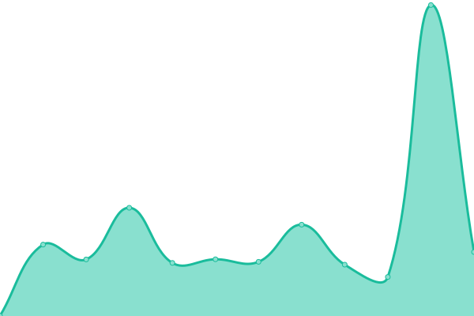 473ms
     
 | 

<a href="https://maxneuvians.github.io/etat-status/history/services-aux-autochtones-canada-indigenous-services-canada-canada-ca">100.00%</a>
    

|  [Supreme Court of Canada | Cour suprême du Canada](https://www.scc-csc.ca) | 🟩 Up | [supreme-court-of-canada-cour-supreme-du-canada.yml](https://github.com/maxneuvians/etat-status/commits/HEAD/history/supreme-court-of-canada-cour-supreme-du-canada.yml) | 

 347ms
     
 | 

<a href="https://maxneuvians.github.io/etat-status/history/supreme-court-of-canada-cour-supreme-du-canada">100.00%</a>
    

|  [Canadian Intergovernmental Conference Secretariat / Secr�tariat des conf�rences intergouvernementales canadiennes](https://www.scics.ca) | 🟩 Up | [canadian-intergovernmental-conference-secretariat-secr-tariat-des-conf-rences-intergouvernementales-canadiennes.yml](https://github.com/maxneuvians/etat-status/commits/HEAD/history/canadian-intergovernmental-conference-secretariat-secr-tariat-des-conf-rences-intergouvernementales-canadiennes.yml) | 

 130ms
     
 | 

<a href="https://maxneuvians.github.io/etat-status/history/canadian-intergovernmental-conference-secretariat-secr-tariat-des-conf-rences-intergouvernementales-canadiennes">100.00%</a>
    

|  [Social Sciences and Humanities Research Council / Conseil de recherches en sciences humaines](https://www.sshrc-crsh.gc.ca) | 🟥 Down | [social-sciences-and-humanities-research-council-conseil-de-recherches-en-sciences-humaines.yml](https://github.com/maxneuvians/etat-status/commits/HEAD/history/social-sciences-and-humanities-research-council-conseil-de-recherches-en-sciences-humaines.yml) | 

 0ms
     
 | 

<a href="https://maxneuvians.github.io/etat-status/history/social-sciences-and-humanities-research-council-conseil-de-recherches-en-sciences-humaines">100.00%</a>
    

|  [Statistics Canada - Canada's national statistical agency / Statistique Canada - Organisme statistique national du Canada](https://www.statcan.gc.ca) | 🟩 Up | [statistics-canada-canada-s-national-statistical-agency-statistique-canada-organisme-statistique-national-du-canada.yml](https://github.com/maxneuvians/etat-status/commits/HEAD/history/statistics-canada-canada-s-national-statistical-agency-statistique-canada-organisme-statistique-national-du-canada.yml) | 

 279ms
     
 | 

<a href="https://maxneuvians.github.io/etat-status/history/statistics-canada-canada-s-national-statistical-agency-statistique-canada-organisme-statistique-national-du-canada">100.00%</a>
    

|  [Transport Canada / Transports Canada](https://www.tc.gc.ca) | 🟩 Up | [transport-canada-transports-canada.yml](https://github.com/maxneuvians/etat-status/commits/HEAD/history/transport-canada-transports-canada.yml) | 

 354ms
     
 | 

<a href="https://maxneuvians.github.io/etat-status/history/transport-canada-transports-canada">100.00%</a>
    

|  [Language selection](https://www.veterans.gc.ca) | 🟩 Up | [language-selection.yml](https://github.com/maxneuvians/etat-status/commits/HEAD/history/language-selection.yml) | 

 280ms
     
 | 

<a href="https://maxneuvians.github.io/etat-status/history/language-selection">100.00%</a>
    

|  [Veterans Review and Appeal Board](https://www.vrab-tacra.gc.ca) | 🟩 Up | [veterans-review-and-appeal-board.yml](https://github.com/maxneuvians/etat-status/commits/HEAD/history/veterans-review-and-appeal-board.yml) | 

 1026ms
     
 | 

<a href="https://maxneuvians.github.io/etat-status/history/veterans-review-and-appeal-board">100.00%</a>
    

|  [Welcome to the Canadian Transportation Accident Investigation and Safety Board | Bienvenue au Bureau de la sécurité des transports du Canada](https://www.tsb.gc.ca) | 🟩 Up | [welcome-to-the-canadian-transportation-accident-investigation-and-safety-board-bienvenue-au-bureau-de-la-securite-des-transports-du-canada.yml](https://github.com/maxneuvians/etat-status/commits/HEAD/history/welcome-to-the-canadian-transportation-accident-investigation-and-safety-board-bienvenue-au-bureau-de-la-securite-des-transports-du-canada.yml) | 

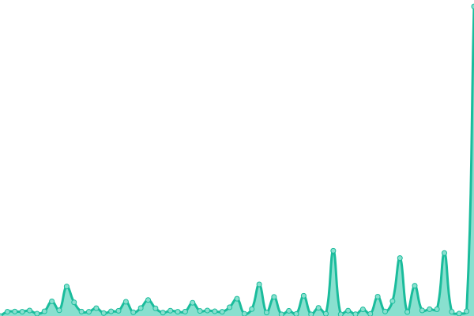 305ms
     
 | 

<a href="https://maxneuvians.github.io/etat-status/history/welcome-to-the-canadian-transportation-accident-investigation-and-safety-board-bienvenue-au-bureau-de-la-securite-des-transports-du-canada">100.00%</a>
    

|  [Western Economic Diversification Canada | Diversification de l'économie de l'Ouest Canada](https://www.wd-deo.gc.ca) | 🟩 Up | [western-economic-diversification-canada-diversification-de-l-economie-de-l-ouest-canada.yml](https://github.com/maxneuvians/etat-status/commits/HEAD/history/western-economic-diversification-canada-diversification-de-l-economie-de-l-ouest-canada.yml) | 

 370ms
     
 | 

<a href="https://maxneuvians.github.io/etat-status/history/western-economic-diversification-canada-diversification-de-l-economie-de-l-ouest-canada">100.00%</a>
    

<!--end: status pages-->

[**Visit our status website →**](https://maxneuvians.github.io/etat-status)

## 📄 License

- Powered by: [Upptime](https://github.com/upptime/upptime)
- Code: [MIT](./LICENSE) © [Anand Chowdhary](https://anandchowdhary.com), supported by [Pabio](https://pabio.com)
- Data in the `./history` directory: [Open Database License](https://opendatacommons.org/licenses/odbl/1-0/)
